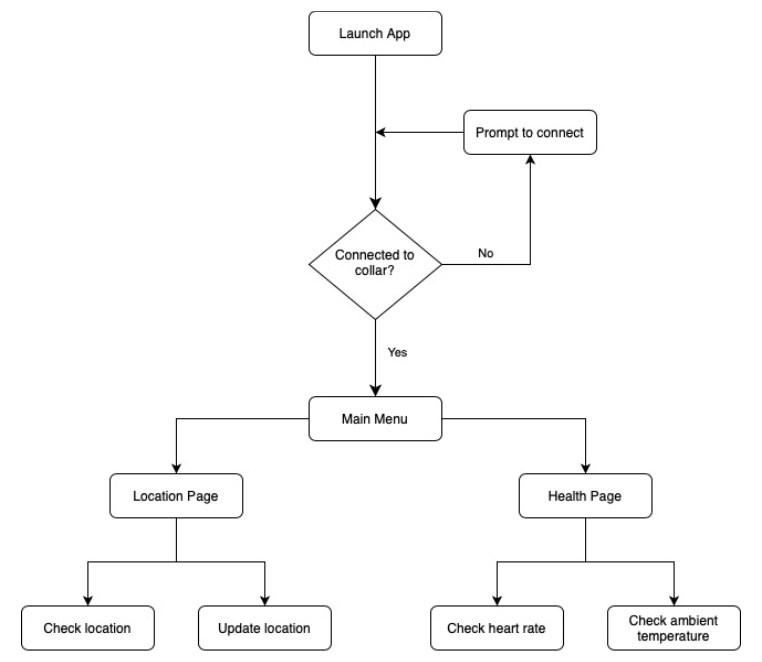

## About The Project

***Currently in development!***  

***Project for ECE 49022 (Senior Design)***

*Mobile App for the SMART Collar!*

Designed for pet owners using the SMART collar, allows functionality to monitor:
- Temperature
- Heart rate
- Location

## Contents

`/Screenshots` contains screenshots of the app, activity diagram, etc.

`/App.s` contains the current code for the app

## Tech Stack

Built using:  
[![React][React.js]][React-url]  
[![Expo][Expo.dev]][Expo-url]

## Activity Diagram

## Screenshots

## Senior Design Team (ECE 49022)

- Ishaan Verma (CompE)
- Nihith Chaturvedula (CompE)
- Connor Davin (EE)
- Miguel Velasco (EE)

## Contact

- Ishaan Verma - vermai@purdue.edu - Purdue Computer Engineering 2022

[React.js]: https://img.shields.io/badge/React_Native-20232A?style=for-the-badge&logo=react&logoColor=61DAFB
[React-url]: https://reactjs.org/
[Expo.dev]: https://img.shields.io/badge/Expo-1B1F23?style=for-the-badge&logo=expo&logoColor=white
[Expo-url]: https://expo.dev/
[Badges-github]: https://github.com/alexandresanlim/Badges4-README.md-Profile