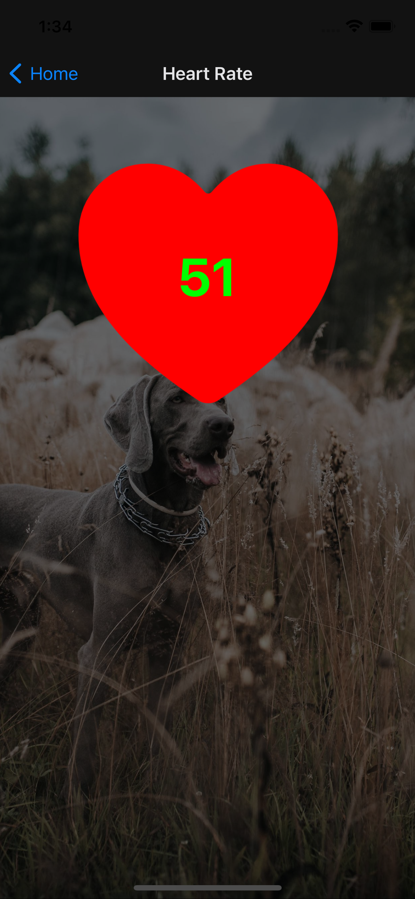

## About The Project

***Currently in development!***  

***Project for ECE 49022 (Senior Design)***

*Mobile App for the SMART Collar!*

Designed for pet owners using the SMART collar, allows functionality to monitor real-time:
- Heart Rate
- Temperature
- Location

## Tech Stack

Built using:  
[![React][React.js]][React-url]  
[![Expo][Expo.dev]][Expo-url]

## Contents

`App.js` - navigation stack and overall layout of app

`package.json` - libraries and packages installed in project

`/components` - reusable components made to be used across the app

`/screens` - various screens that are displayed to the user

`/assets` - icons and logos used within the app

`/screenshots` - screenshots of the design, activity diagram, etc.

## Activity Diagram

## Screenshots

   
  
  

## Team 53 - ECE 49022 - Senior Design

- Ishaan Verma (CompE)
- Nihith Chaturvedula (CompE)
- Connor Davin (EE)
- Miguel Velasco (EE)

## Contact

- Ishaan Verma - vermai@purdue.edu - Purdue Computer Engineering 2022

[React.js]: https://img.shields.io/badge/React_Native-20232A?style=for-the-badge&logo=react&logoColor=61DAFB
[React-url]: https://reactjs.org/
[Expo.dev]: https://img.shields.io/badge/Expo-1B1F23?style=for-the-badge&logo=expo&logoColor=white
[Expo-url]: https://expo.dev/
[Badges-github]: https://github.com/alexandresanlim/Badges4-README.md-Profile